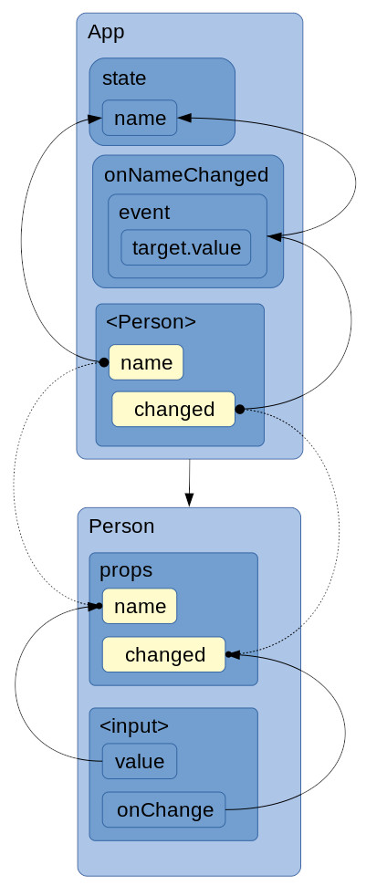
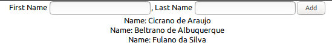
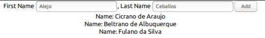
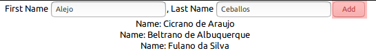
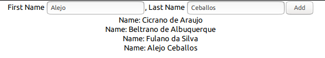

# React Study

[Glossary](https://reactjs.org/docs/glossary.html)

## New React Application

+ [Official site](https://facebook.github.io/create-react-app/ "Create React App")
+ [Github](https://github.com/facebook/create-react-app "facebook/create-react-app")


#### npx create-react-app `<name of application>`:

```bash
npx create-react-app my--new-app
```

## Updating

+ npm install `lib@version`:

```bash
npm install react-scripts@latest
```

## Basic commands:

Inside project's directory...


Starts the development server:

```bash
npm start
```

Bundles the app into static files for production:

```bash
npm run build
```

Starts the test runner:

```bash
npm test
```
    
Removes this tool and copies build dependencies, configuration files and scripts into the app directory. If you do this, 
you can’t go back!

```bash
npm run eject
```

## JSX

+ JSX is NOT HTML;
+ Just syntactic sugar for JavaScript;
+ Have keyword limitations
  + ex: 
    + Cannot use "class" for CSS classes, use "className" since "class" is a Javascript keyword;
    + Do not use "onclick" property (lowercase) to call methods from components, use "onClick" (camel case). Also call 
    the method within curly braces;
+ Must have only one root element, all the others must be nested inside it; 

## New component structure

+ Core building block of React apps;
+ React app could be depicted as a component tree;

> React components are small, reusable pieces of code that return a React element to be rendered to the page. The 
simplest version of React component is a plain JavaScript function that returns a React element ... Components can also 
be ES6 classes ([Glossary](https://reactjs.org/docs/glossary.html#components))

#### Basic

```
.
.
+- public
+- src
  +- ComponentName
    +- ComponentName.js
.
.  
```

#### Component from a class (class-based components)

```js
import React, { Component } from 'react';

class ComponentName extends Component {
  render() {
    return (
      <div className="...">
          . . .
      </div>
    );
  }
}

export default ComponentName;

```

#### Component from a function (Functional components)

```js
import React from 'react';

const componentName = () => {
    return (
        <div className="...">
            . . .
        </div>
    );
}

export default componentName;

```
**NOTE:** functional components is the best practice (according Maximilian Schwarzmüller)

#### Using a custom component:

```js
. . .
import React, { Component } from 'react';
import ComponentName form './ComponentName/ComponentName'
. . .
class AnotherComponent extends Component {
  render() {
    return (
      <div className="...">
         . . .
         <ComponentName>
            . . .
         </ComponentName>            
         . . .
      </div>
    );
  }
}
. . .

```

## Dynamic content

Use curly braces ( "{" and "}" ).

```js
. . .
const componentName = () => {
    return (
        <div className="...">
            A random number would be: { Math.random() }!
        </div>
    );
}
. . .
```

#### Passing arguments to a component:

Declaring...

```js
. . .
const componentName = (props) => {
    return (
        <div className="...">
            A random number would be: { props.randomNumber }!
        </div>
    );
}
. . .
```
... And using it...

```js
. . .
class AnotherComponent extends Component {
  render() {
    return (
      <div className="...">
         . . .
         <ComponentName randomNumber="44" />
      </div>
    );
  }
}
. . .

```

> props are inputs to a React component. They are data passed down from a parent component to a child component. 
([Glossary](https://reactjs.org/docs/glossary.html#props))

#### Passing components to a component:

+ App:

```js
import React, {Component} from 'react';
import './App.css';
import Person from ListItem;
import Child from './Family/Child';

class App extends Component {
    render() {
        return (
            <div className="App">
                <Person pAttr="whatever">
                    <Child cAttr="whoever"/>
                </Person>
            </div>
        );
    }
}

export default App;
```

+ Parent:

```js
import React from 'react';

const parent = (props) => {
    return (
        <div>
            <p>What? {props.pAttr}. {props.children}</p>
        </div>
    )
};

export default parent;
```

+ Child:

```js
import React from 'react';

const child = (props) => {
    return (
        <span>Who? {props.cAttr}.</span>
    )
};

export default child;
```

+ Result (displayed):

```
What? whatever. Who? whoever.
```

+ Result (HTML):

```html
<div id="root">
    <div class="App">
        <div>
            <p>What? whatever. <span>Who? whoever.</span></p>
        </div>
    </div>
</div>
```

## State
  
### In components

Declaring a property `state` inside a component class! `state` is reserved!

```js
. . .
class MyComponent extends Component {
    state: { };
    
    render() {
        . . .
    }
}
. . .
```

> The most important difference between state and props is that props are passed from a parent component, but state is 
managed by the component itself. A component cannot change its props, but it can change its state. To do so, it must 
call this.setState(). Only components defined as classes can have state. 
([Glossary](https://reactjs.org/docs/glossary.html#state))

### In Functions

See: [Using the State Hook](https://reactjs.org/docs/hooks-state.html)

Note: "setter" from `useState` does not merge objects, it replaces it.

Example:

```javascript
const [obj, setObj] = useState({ name: "Me", address: "Here"});
```

`obj` will be:

```javascript
{ 
    name: "Me", 
    address: "Here"
}
```

Then set new value to `name`:

```javascript
setObj({ name: "You" });
```

`obj` will be:

```javascript
{ 
    name: "You"
}
```

Now `address` is gone. 

To solve this...

1) You can change the specific attribute of the object:

```javascript
obj['name'] = 'You';
setObj(obj);
```

2) You can merge both objects:

```javascript
setObj({ ...obj, ...{ name: 'You'} });
```

3) You can use two states:

```javascript
const [name, setName] = useState("Me");
const [address, setAddress] = useState("Here");
setName('You');
```

### Stateful vs Stateless Components

#### Stateful Components

+ Class based components;
+ Function based components using `useState`;

**a.k.a:** "Smart components" or "Container components";

#### Stateless Components

+ Function based components NOT using `useState`;

**a.k.a:** "Dumb components" or "Presentational components";

#### TIP

Use stateless more often than stateful to be clear easier to maintain and manage:

+ Clear where to change something related to state;
+ Prevents spaghetti code where everyone does everything;
+ Clear flow of data;
+ Easy to detect were your data "sits", changes and it's distributed to the rest of your application;

## Working with events

Reference: [React Supported Events](https://reactjs.org/docs/events.html#supported-events)

## Two Way Binding

+ The upper most (wrapper) component:

```javascript
import React, {Component} from 'react';
import './App.css';
import Person from './Family/Parent';

class App extends Component {
    state = {
        person: {
            name: "Alejo"
        }
    };

    onNameChanged = (event) => {
        this.setState({
            person: {
                name: event.target.value
            }
        })
    };

    render() {
        return (
            <div className="App">
                <Person name={this.state.person.name} changed={this.onNameChanged}/>
            </div>
        );
    }
}

export default App;
```

+ The wrapped component:

```javascript
import React, { Component } from 'react';

class Parent extends Component {
    render() {
        return (
            <div>
                <p>Name: {this.props.name}</p>
                <input
                    type="text"
                    onChange={this.props.changed}
                    value={this.props.name}
                />
            </div>
        )
    }
}

export default Parent;
```

+ Bindings:



### Passing Data Up in the Hierarchy (example)

1. With a simple Form and a List:

    

2. Fill the form:

    

3. Press "Add" button:

    

4. The list grows:

    

#### App

```javascript
import React, {Component} from 'react';
import './App.css';
import List from './List/List';
import AddItem from './List/AddItem';

class App extends Component {
    state = {
        list: [
            { firstName: "Cicrano", lastName: "de Araujo"},
            { firstName: "Beltrano", lastName: "de Albuquerque"},
            { firstName: "Fulano", lastName: "da Silva"},
        ]
    };

    onAddItem = (firstName, lastName) => {
        const list = this.state.list;
        list.push({firstName, lastName});
        this.setState(list)
    };

    render() {
        return (
            <div className="App">
                <AddItem onAddItem={this.onAddItem}/>
                <List list={this.state.list}/>
            </div>
        );
    }
}

export default App;
```

#### List/AddItem

```javascript
import React from 'react';

export default (props) => {
    let firstName = "";
    let lastName = "";

    const onFirstNameChanged = (event) => {
        firstName = event.target.value;
    };

    const onLastNameChanged = (event) => {
        lastName = event.target.value;
    };

    const addItem = () => {
        props.onAddItem(firstName, lastName);
    };

    return (
        <div>
            First Name <input type="text" onChange={onFirstNameChanged} />,
            Last Name <input type="text" onChange={onLastNameChanged} />
            <button onClick={addItem}>Add</button>
        </div>
    );
}
```

#### List/List

```javascript
import React from 'react';
import ListItem from './ListItem';

export default (props) => {
    const list = props.list.map(item => <ListItem firstName={item.firstName} lastName={item.lastName}/>);

    return (
        <div>
            {list}
        </div>
    )
}
```

#### List/ListItem

```javascript
import React from 'react';

export default (props) => {
    return (
        <div>
            <span>Name: {props.firstName} {props.lastName}</span>
        </div>
    )
}
```
